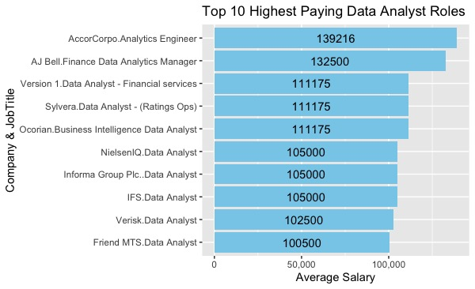
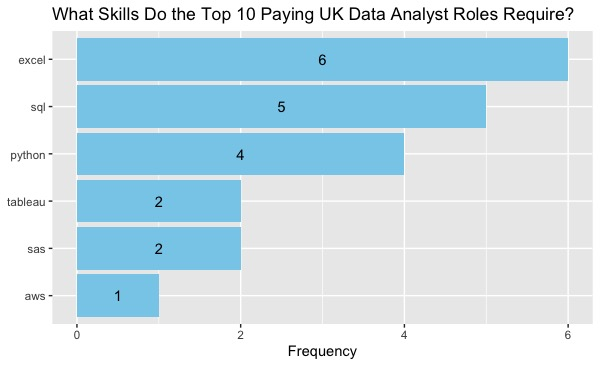

# Introduction
📈An insight into the data job market! This project explores top paying jobs, most in-demand skills and where high demand meets high salaries in Data Analytics.

Click here for SQL queries: [project_sql folder](/project_sql/)

# Background

Curious about the UK data analyst job market, I embarked on a journey to delve deeper into key aspects such as job location and the technical skills that are most in demand and also have the highest ROI in regards to pay.

The data can be found at the following [link](https://datanerd.tech/) which is full of information on job titles, salaries, locations and skills.

### The questions I wanted to answer using SQL queries were:

1. What are the top-paying data analyst jobs?
2. What are the top-paying skills for data analyst roles?
3. What are the most in demand skills for data analyst roles?
4. What skills have the highest average salary?
5. What are the optimal skills to learn in relation to salary and demand?

# Tools I used

- **SQL**: Base of my analysis, providing the opportunity to query the database and discover actionable insights.
- **PostgreSQL**: The database management system I chose for executing my queries
- **Visual Studio Code**: My preferred tool for database management and SQL queries
- **Git/GitHub**: For version control and showcasing my SQL scripts
- **R/RStudio**: To practice producing graphs using the ggplot2 package and using tools collaboratively.

# Analysis

Each query aims to delve deeper into specific aspects of the data analyst job market.
Below is how I approached each query:

## 1. Highest Paying Data Analyst Jobs
To identity the highest paying jobs I filtered the data by the job title, average yearly salary and location, focusing on jobs in London. I joined the job_postings_fact table to the company_dim table to query the name of the company providing the role.

```sql
SELECT
    job_id,
    c.name AS company_name,
    job_title,
    job_location,
    salary_year_avg,
    DATE(job_posted_date)
FROM    
    job_postings_fact jp
LEFT JOIN
    company_dim c
ON
    jp.company_id = c.company_id
WHERE  
    job_title_short = 'Data Analyst'
    AND job_location LIKE '%UK'
    AND (job_title ILIKE '%analytic%' 
        OR job_title ILIKE '%analyst%')
    AND salary_year_avg IS NOT NULL
ORDER BY
    salary_year_avg DESC
LIMIT 10;
```

Here is a summary of the top paying data analyst jobs in the UK:
- **Salary Range**: The top 10 highest paying roles range from $100,500 to $139,216, showing the high salary potential in the field.
- **Job Location**: 50% of the 10 highest paying roles in the UK are located in London, indicating the earning potential may be higher in London.
- **Variety of Employers** : There are 10 unique companies offering high salaries, which demonstrates an interest in data analysts across a number of industries.



*Bar graph visualising the top 10 salaries for data analyst roles, displaying the company and job title on the y-axis. This graph was created in R, after exporting the results from the SQL query above as a csv file.*

## 2. Top Paying Skills
To determine what skills the highest paying jobs require, I used the previous query as a CTE and joined it to the skills data. This allowed me to display the skills required for each role.

```sql
WITH top_10 AS (
SELECT
    job_id,
    c.name AS company_name,
    job_title,
    job_location,
    salary_year_avg
FROM    
    job_postings_fact jp
LEFT JOIN
    company_dim c
ON
    jp.company_id = c.company_id
WHERE  
    job_title_short = 'Data Analyst' 
    AND (job_title ILIKE '%analytic%'     -- avoid non data analyst roles
        OR job_title ILIKE '%analyst%')
    AND job_location LIKE '%UK'
    AND salary_year_avg IS NOT NULL
ORDER BY
    salary_year_avg DESC
LIMIT 10
)

SELECT
    t.*,
    s.skills
FROM top_10 t
INNER JOIN
    skills_job_dim sj 
ON
    t.job_id = sj.job_id
INNER JOIN
    skills_dim s
ON
    sj.skill_id = s.skill_id
ORDER BY
    salary_year_avg DESC;
```

Here is a summary of these skills required by the highest paying roles:
- **Excel** leads with a count of 6
- **SQL** (5) and **Python** (4) rank 2nd and 3rd.
- **Tableau**, **SAS**, **AWS** and others all show varying levels of demand.



*Bar graph visualising the count of skills required by the 10 highest-paying roles. This graph was also created in R with the ggplot2 package after exporting SQL query results as a csv file.*

## 3. In-demand skills for Data Analysts
I aimed to find the skills that are most common in job postings through the following query, this would help those transitioning into a data analytics career understand where to focus their attention.

```sql
SELECT 
    skills,
    COUNT(*) as demand
FROM job_postings_fact jp
INNER JOIN
    skills_job_dim sj
ON
    jp.job_id = sj.job_id
INNER JOIN
    skills_dim sd
ON
    sj.skill_id = sd.skill_id
WHERE
    job_title_short = 'Data Analyst' 
    AND (job_title ILIKE '%analytic%'     -- avoid non data analyst roles
        OR job_title ILIKE '%analyst%') 
    AND job_location LIKE '%UK'
GROUP BY
    skills
ORDER BY
    demand DESC;

```
Here is a breakdown of the results:
- **Excel** (3,019) and **SQL** (3,013) are the most in-demand skills. Proficiency in both is essential for UK data analysts.
- **PowerBI** (1,982) follows, displaying a strong demand for data visualisation tools.
- **Python** (1,338) is the leading programming language.
- **Tableau** (1,052) and **R** (687) rank at 5th and 6th, suggesting a lower but relevant demand for specific roles.

| Skill    | Demand |
|----------|--------|
| Excel    | 3019   |
| SQL      | 3013   |
| Power BI | 1982   |
| Python   | 1338   |
| Tableau  | 1052   |
| R        | 687    |

## 4. Skills Based on Salary

Gaining insights on which skills are the highest-paying by exploring average salaries associated with each skill.

```sql
WITH SalaryStats AS (
    SELECT 
        PERCENTILE_CONT(0.25) WITHIN GROUP (ORDER BY salary_year_avg) AS Q1,
        PERCENTILE_CONT(0.75) WITHIN GROUP (ORDER BY salary_year_avg) AS Q3
    FROM job_postings_fact
    WHERE job_title_short = 'Data Analyst'
        AND job_location LIKE '%UK'
        AND salary_year_avg IS NOT NULL
        AND (job_title ILIKE '%analyst%' OR job_title ILIKE '%analytic%')

)
SELECT 
    sd.skills,
    AVG(jp.salary_year_avg) AS avg_salary
FROM job_postings_fact jp
INNER JOIN skills_job_dim sj ON jp.job_id = sj.job_id
INNER JOIN skills_dim sd ON sj.skill_id = sd.skill_id
CROSS JOIN SalaryStats s
WHERE job_title_short = 'Data Analyst'
    AND job_location LIKE '%UK'
    AND salary_year_avg BETWEEN (s.Q1 - 1.5 * (s.Q3 - s.Q1)) AND (s.Q3 + 1.5 * (s.Q3 - s.Q1)) -- IQR filter
    AND (job_title ILIKE '%analyst%' OR job_title ILIKE '%analytic%')
GROUP BY sd.skills
ORDER BY avg_salary DESC;
```

Here is a summary of the average highest-paying skills for UK Data Analysts:

- This query applies an IQR filter to remove extreme salary outliers, making the results more reliable. However, some skills still appear with unexpectedly high average salaries, suggesting potential data quality issues—such as misclassified job postings, skill misattribution, or a small sample size skewing results.

- While the query itself is logically sound, this situation reinforces the importance of **validating data sources** and cross-checking insights before making conclusions. In a real-world setting, I would explore additional data-cleaning techniques, such as stricter job title filters, checking sample sizes, and investigating skill tagging methods, to ensure more accurate analysis.

| Skill | Salary ($) |
| ---- | ---- |
| aws | 111175 |
| javascript | 111175 |
| powerpoint | 105837 |
| dax | 105000 |
| oracle | 104837 |
| power bi | 100816 |

## 5. Optimal Skills to Learn

Merging insights from demand and average salaries, this query aims to display skills that have both high demand and high salaries to provide a strategic plan for skill development.

```sql
SELECT
    sd.skill_id,
    sd.skills,
    COUNT(*) AS demand,
    ROUND(AVG(salary_year_avg)) AS avg_salary
FROM
    job_postings_fact jp
INNER JOIN skills_job_dim sj ON jp.job_id = sj.job_id
INNER JOIN skills_dim sd ON sj.skill_id = sd.skill_id
WHERE
    job_title_short = 'Data Analyst'
    AND salary_year_avg IS NOT NULL
    AND job_work_from_home = TRUE
    AND (job_title ILIKE '%analyst%' OR job_title ILIKE '%analytic%')
GROUP BY sd.skill_id
HAVING
    COUNT(*) > 10
ORDER BY
    avg_salary DESC,
    demand DESC
LIMIT 25;
```
| skill_id | skills     | demand | avg_salary |
|----------|------------|--------|------------|
| 8        | go         | 27     | 115,320    |
| 234      | confluence | 11     | 114,210    |
| 97       | hadoop     | 22     | 113,193    |
| 80       | snowflake  | 35     | 112,688    |
| 77       | bigquery   | 12     | 108,792    |
| 4        | java       | 17     | 106,906    |
| 194      | ssis       | 12     | 106,683    |
| 233      | jira       | 20     | 104,918    |

*Table showcasing the optimal skills for data analysts sorted by salary*

Here is a summary of the results:

- **High-demand skills**: Python (229), Tableau (223) and R (142) have very high demand, however they have lower average salaries ranging from $98,645 to $99,851. This indicates that these skills are highly valued but also widely available.
- **Cloud Tools/Technologies**: Specialised technologies such as Snowflake, BigQuery, AWS and Azure show a significant demand and average salaries ranging upwards of $104,427. This represents a steady growth in the usage of cloud platforms and big data technologies in data analysis.
- **Data Visualisation Tools**: Tableau and Looker, with respective demand counts of 223 and 49, and average salaries of $98,645 and $103,795, showcase the need for data visualisation to display actionable insights from data.

# What I learned

- 🧱Building Complex Queries: I was able to effectively use joins and CTEs to provide important aspects about the data analyst job market.
- 🎯Practical Strategy: This project has helped me realign my focus on which skills are most important for landing my first data analysis role.
- 📊Data Aggregation/SQL Keywords: Confidently used GROUP BY alongside aggregate functions to summarise data and provide meaningful insights.

# Conclusion

## Final Insights:

1. **Highest Paying Data Analyst Jobs:** There is a wide range of salaries, ranging up to $135,000+. 50% of these roles are located in London.

2. **Top-Paying Skills:** Excel, SQL and Python are consistently utilised in top paying roles.

3. **In-Demand Skills:** Excel and SQL are also the most in-demand skills and are critical for job seekers. Followed up by PowerBI, Python, Tableau and R.

4. **Skills with Higher Salaries:** Further data validation required, however it is likely that specialised skills will result in higher average salaries.

5. **Optimal Skills to Learn:** Python, Tableau have the greatest demand in their field of usage (programming and BI/data visualisation). Cloud tools and Big Data technologies such as Snowflake and BigQuery are becoming increasingly valuable.

## Closing Thoughts

This project allowed me to use my SQL knowledge in a practical manner, become more confident in SQL queries and also shed light on how to better manage my time dedicated towards skills development. To land my first data role, it is optimal to primarily focus on my proficiency of high in-demand skills such as Excel and SQL.